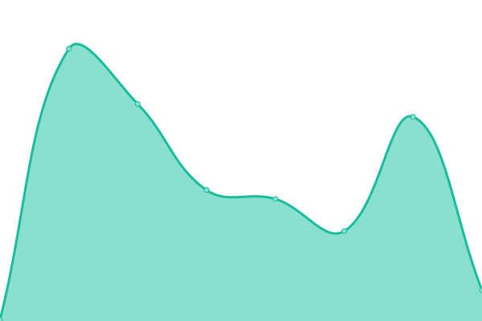

# [📈 Live Status](https://bigfoot65.github.io/amahi): <!--live status--> **🟩 All systems operational**

This repository contains the open-source uptime monitor and status page for [bigfoot65](https://bigfoot65.github.io/amahi), powered by [Upptime](https://github.com/upptime/upptime).

With [Upptime](https://upptime.js.org), you can get your own unlimited and free uptime monitor and status page, powered entirely by a GitHub repository. We use [Issues](https://github.com/bigfoot65/amahi/issues) as incident reports, [Actions](https://github.com/bigfoot65/amahi/actions) as uptime monitors, and [Pages](https://bigfoot65.github.io/amahi) for the status page.

<!--start: status pages-->
<!-- This summary is generated by Upptime (https://github.com/upptime/upptime) -->
<!-- Do not edit this manually, your changes will be overwritten -->
<!-- prettier-ignore -->
| URL | Status | History | Response Time | Uptime |
| --- | ------ | ------- | ------------- | ------ |
|  [Web Site](https://www.amahi.org) | 🟩 Up | [web-site.yml](https://github.com/bigfoot65/amahi/commits/HEAD/history/web-site.yml) | 

 622ms
     
 | 

<a href="https://bigfoot65.github.io/amahi/history/web-site">100.00%</a>
    

|  [Wiki](https://wiki.amahi.org) | 🟩 Up | [wiki.yml](https://github.com/bigfoot65/amahi/commits/HEAD/history/wiki.yml) | 

 916ms
     
 | 

<a href="https://bigfoot65.github.io/amahi/history/wiki">100.00%</a>
    

|  [Forums](https://forums.amahi.org) | 🟩 Up | [forums.yml](https://github.com/bigfoot65/amahi/commits/HEAD/history/forums.yml) | 

 249ms
     
 | 

<a href="https://bigfoot65.github.io/amahi/history/forums">100.00%</a>
    

|  [Bug Tracker](https://bugs.amahi.org) | 🟩 Up | [bug-tracker.yml](https://github.com/bigfoot65/amahi/commits/HEAD/history/bug-tracker.yml) | 

 165ms
     
 | 

<a href="https://bigfoot65.github.io/amahi/history/bug-tracker">100.00%</a>
    

|  [Blog](https://blog.amahi.org) | 🟩 Up | [blog.yml](https://github.com/bigfoot65/amahi/commits/HEAD/history/blog.yml) | 

 725ms
     
 | 

<a href="https://bigfoot65.github.io/amahi/history/blog">100.00%</a>
    

|  [Anywhere Relay](https://pfe.amahi.org/debug) | 🟩 Up | [anywhere-relay.yml](https://github.com/bigfoot65/amahi/commits/HEAD/history/anywhere-relay.yml) | 

 178ms
     
 | 

<a href="https://bigfoot65.github.io/amahi/history/anywhere-relay">89.08%</a>
    

|  [Sync Storage](http://cpg.amahi.me/Public/isthisworking.txt) | 🟩 Up | [sync-storage.yml](https://github.com/bigfoot65/amahi/commits/HEAD/history/sync-storage.yml) | 

 77ms
     
 | 

<a href="https://bigfoot65.github.io/amahi/history/sync-storage">100.00%</a>
    

|  [F25 Repo](http://f25.amahi.org) | 🟩 Up | [f25-repo.yml](https://github.com/bigfoot65/amahi/commits/HEAD/history/f25-repo.yml) | 

 126ms
     
 | 

<a href="https://bigfoot65.github.io/amahi/history/f25-repo">100.00%</a>
    

|  [F27 Repo](http://f27.amahi.org) | 🟩 Up | [f27-repo.yml](https://github.com/bigfoot65/amahi/commits/HEAD/history/f27-repo.yml) | 

 117ms
     
 | 

<a href="https://bigfoot65.github.io/amahi/history/f27-repo">100.00%</a>
    

|  [F35 Repo](http://f35.amahi.org) | 🟩 Up | [f35-repo.yml](https://github.com/bigfoot65/amahi/commits/HEAD/history/f35-repo.yml) | 

 119ms
     
 | 

<a href="https://bigfoot65.github.io/amahi/history/f35-repo">100.00%</a>
    

<!--end: status pages-->

[**Visit our status website →**](https://bigfoot65.github.io/amahi)

## 📄 License

- Powered by: [Upptime](https://github.com/upptime/upptime)
- Code: [MIT](./LICENSE) © [bigfoot65](https://bigfoot65.github.io/amahi)
- Data in the `./history` directory: [Open Database License](https://opendatacommons.org/licenses/odbl/1-0/)
